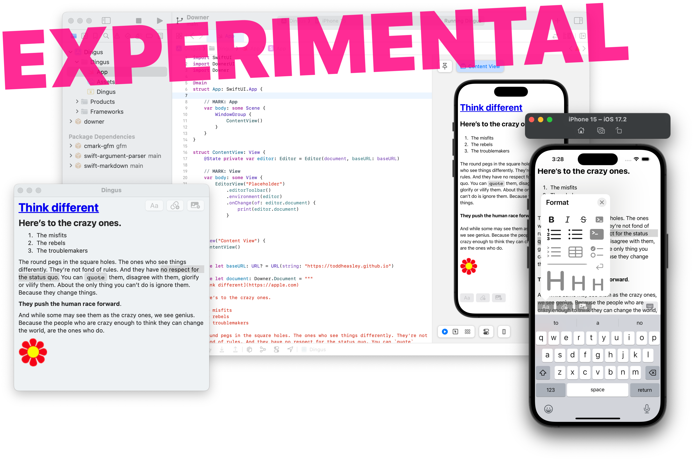

# Downer

__[Markdown](https://daringfireball.net/projects/markdown) toolkit for Swift and SwiftUI__

### Supported Platforms

Written in [Swift](https://developer.apple.com/swift) 5.9 for Apple stuff:

* [macOS](https://developer.apple.com/macos) 14 Sonoma
* [iOS](https://developer.apple.com/ios)/[iPadOS](https://developer.apple.com/ipad)/[tvOS](https://developer.apple.com/tvos) 17
* [watchOS](https://developer.apple.com/watchos) 10
* [visionOS](https://developer.apple.com/visionos)

Build with [Xcode](https://developer.apple.com/xcode) 15 or newer. Command-line interface depends on [Swift Argument Parser.](https://github.com/apple/swift-argument-parser)

## WYSIWYG WIP 




`EditorView` is a SwiftUI 

```swift
import SwiftUI
import DownerUI
import Downer

struct ContentView: View {
    @State private var editor: Editor = Editor(document, baseURL: baseURL)
    
    var body: some View {
        EditorView("Placeholder")
            .editorToolbar()
            .environment(editor)
            .onChange(of: editor.document) {
                print(editor.document)
            }
    }
}
```


## Command-Line Interface

__File-based processing for Mac workflows__

`Downer` package includes `downer-cli`, an executable target for processing individual Markdown files. Given a path to any text file, `downer-cli` creates both HTML and formatted Markdown versions, preserving the source file:

```zsh
toddheasley % ls
README.md
toddheasley % ./downer-cli README.md 
Saved: README~.md
Saved: README.html
toddheasley % ls
README.html	README.md	README~.md
```

 Use `--convert` to convert HTML in source file to Markdown syntax when possible:

```zsh
toddheasley % ./downer-cli README.md -c
```

Use `--replace` to overwrite the source file:

```zsh
toddheasley % ls
README.md
toddheasley % ./downer-cli README.md -r
Saved: README.md
Saved: README.html
toddheasley % ls
README.html	README.md
```

Use `--format` to generate only one format or the other:

```zsh
toddheasley % ls
README.md
toddheasley % ./downer-cli README.md -f hypertext
Saved: README.html
toddheasley % ls
README.html	README.md
```

## `Downer` Reference

### Markdown Syntax

`Downer` parses [GitHub Flavored Markdown](https://github.github.com/gfm) using [cmark-gfm.](https://github.com/github/cmark-gfm) It mostly behaves like you'd expect, but it's weird and opinionated about a handful of things that I'm weird and opinionated about. Specifically:

* [List items](https://github.github.com/gfm/#list-items) are leaf blocks. When list items contain multiple child blocks, only the inline content from the first child block is selected. Additional blocks are discarded. 
* [Link reference definitions](https://github.github.com/gfm/#link-reference-definitions) are ignored _and_ discarded during parsing.
* Hypertext format renders [strong emphasis](https://github.github.com/gfm/#emphasis-and-strong-emphasis) with HTML `<b>` tags, instead of `<strong>`.
* Basic support for [Flavored autolinks](https://github.github.com/gfm/#autolinks-extension-) is [included but disabled by default.](#byo-autolinks)

Other Flavored extensions for [strikethrough](https://github.github.com/gfm/#strikethrough-extension-), [tables](https://github.github.com/gfm/#tables-extension-) and [task lists](https://github.github.com/gfm/#task-list-items-extension-) are fully supported.

### Examples

`Downer` adopts the same document structure and element naming conventions as its underlying parser, [Swift Markdown.](https://github.com/apple/swift-markdown) Elements are re-parsed into self-rendering, concrete types:

```swift
import Downer

let document: Document = """
[Think different](https://apple.com)
===

Here's to the crazy ones.
-------------------------

1. The misfits
1. The rebels
1. The troublemakers

The round pegs in the square holes. The ones who see things differently. They're not fond of rules. And they have no respect for the status quo. You can `quote` them, disagree with them, glorify or vilify them. About the only thing you can't do is ignore them. Because they change things.

**They push the human race forward**.

And while some may see them as the crazy ones, we see genius. Because the people who are crazy enough to think they can change the world, are the ones who do.
"""

print(document.elements.first) // # [Think different](https://www.apple.com)
print(document.elements.count) // 6
```

`Document` has two rendering modes, `Format.hypertext` and `.markdown`:

```swift
print(document.description(.hypertext))
```

```html
<h1><a href="https://apple.com">Think different</a></h1>
<h2>Here’s to the crazy ones.</h2>
<ol>
    <li>The misfits</li>
    <li>The rebels</li>
    <li>The troublemakers</li>
</ol>
<p>The round pegs in the square holes. The ones who see things differently. They’re not fond of rules. And they have no respect for the status quo. You can <code>quote</code> them, disagree with them, glorify or vilify them. About the only thing you can’t do is ignore them. Because they change things.</p>
<p><b>They push the human race forward</b>.</p>
<p>And while some may see them as the crazy ones, we see genius. Because the people who are crazy enough to think they can change the world, are the ones who do.</p>
```

Markdown renders by default:

```swift
print(document)
```

```markdown
# [Think different](https://apple.com)

## Here’s to the crazy ones.

1. The misfits
2. The rebels
3. The troublemakers

The round pegs in the square holes. The ones who see things differently. They’re not fond of rules. And they have no respect for the status quo. You can `quote` them, disagree with them, glorify or vilify them. About the only thing you can’t do is ignore them. Because they change things.

__They push the human race forward__.

And while some may see them as the crazy ones, we see genius. Because the people who are crazy enough to think they can change the world, are the ones who do.
```

#### BYO Autolinks

`Autolink.link` and `.email` are the two included autolinking rules. They cover only the least fuzzy cases where plain-text web and email addresses are prefixed with `http:`, `https:` or `mailto:` protocols.

Autolink at your own risk:

```swift
extension Autolink: CaseIterable {
    static let fileLink: Self = Self("File", "(?<!\")(file:\\/\\/\\/)([\\w\\-\\.!~?&+\\*'\"(),\\/]+)", "<a href=\"$1$2\">$2</a>")
    static let allCases: [Self] = [.link, .fileLink]
}

let html: String = document.description(.hypertext(Autolink.allCases + [
    Autolink("Path", "(^|\\s)/([\\w\\-\\.!~#?&=+\\*'\"(),\\/]+)", "$1<a href=\"$2\">$2</a>")
]))
```
